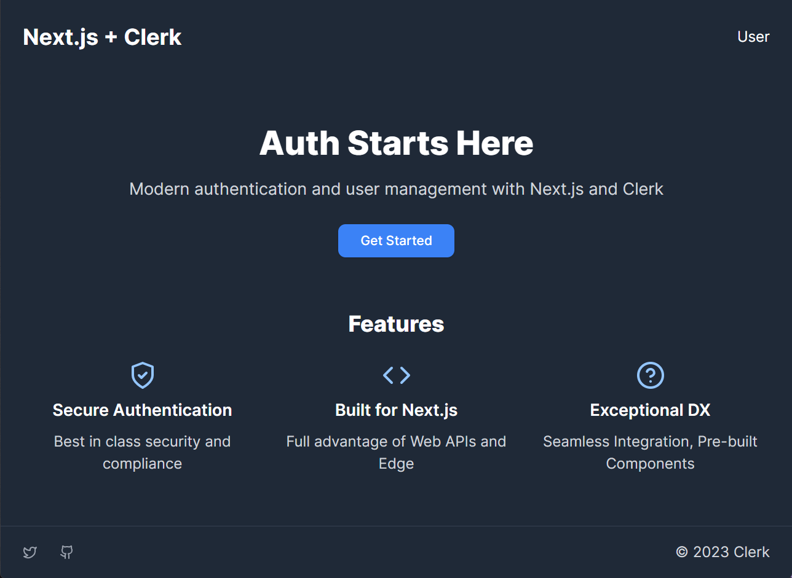

# Next.js Clerk Demo


This repository is used as a demo of [Clerk's](https://www.clerk.com/?utm_source=github&utm_medium=template_repos&utm_campaign=nextjs_template) modern auth features in a Next.js application. This was originally created for [Next.js Conf 23](https://nextjs.org/conf).

[](https://discord.com/invite/b5rXHjAg7A)
[](https://docs.clerk.com)
[](https://twitter.com/intent/follow?screen_name=ClerkDev)


## Running the demo

```bash
git clone https://github.com/devagrawal09/clerk-nextjs-demo
```

To run the demo locally you need to:

1. Sign up for a Clerk account at https://clerk.com.
2. Go to [Clerk's dashboard](https://dashboard.clerk.com?utm_source=github&utm_medium=template_repos&utm_campaign=nextjs_template) and create an application.
3. Set the required Clerk environment variables as shown in [the example env file](./.env.example).
4. `npm install` the required dependencies.
5. `npm run dev` to launch the development server.

## Presenting the demo
1. Basic demo
   1. Add middleware
   2. Add SignIn component
   3. Add UserButton
2. Next.js Demo
   1. App router
   2. Pages router
   3. Client side
3. Edge Auth
   1. Architecture
   2. Server APIs
4. (Optional) Multi-tenancy
   1. Introduction
   2. Add OrgSwitcher
   3. Fetch members list
5. (Optional) UI Customization
   1. Add UserProfile
   2. Change primary color and font family
   3. Add Tailwind class
   4. Add style object
6. (Optional) Clerk Dashboard
   1. Visit Dashboard
   2. Users and Orgs
   3. Auth Factors
7. (WIP) Supabase Integration

